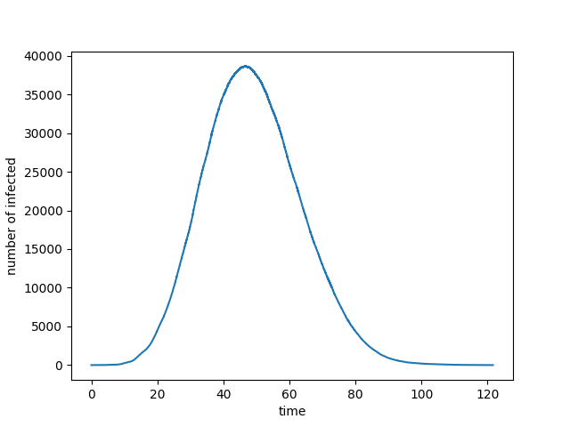

# NEXT-NetPy

*NEXTNetR* (**N**ext-reaction-based **E**pidemics e**X**tended to **T**emporal **Net**works) is a Python package for the efficient simulation of epidemics on complex networks (including weighted and temporal networks) with arbitrary transmission and recovery time distributions. *NEXTNetPy* is a pybind11-based Python wrapper around the C++ library [*NEXTNet*](https://github.com/oist/NEXTNet).

See the [*NEXTNetPy* website](https://oist.github.io/NEXTNetPy/) for a reference and usage examples.

# Installation

Download the [latest released](https://github.com/oist/NEXTNetPy/releases) version of *NEXTNetPy-v\<version\>-pkg.tar.gz* and install with

    pip install NEXTNetPy-v<version>-pkg.tar.gz
   
Since *NEXT-Net* is implemented in C++, a C++ compiler is required to install *NEXTNetPy*. Alternatively, if [Git](https://git-scm.com/downloads) is available, the [latest released](https://github.com/oist/NEXTNetPy/releases) version of *NEXTNetPy* can be downloaded, built and installed with

    git clone --recurse-submodules --branch latest-release https://github.com/oist/NEXTNetPy.git
    cd NEXTNetPy
    pip install .    

# Getting started

Here is an example of how to run a SIR simulation on a Barabasi-Albert random graph using networkx.

```python
import nextnet as nn
import networkx as nx
import matplotlib.pyplot as plt

n = 10**5 # size of the network
m = 1 # number of edges added per node
graph_nx = nx.barabasi_albert_graph(n,m)

# convert network to a NextNet object.
graph = nn.networkx(graph_nx)


# Define the distribution for the infection times (Gamma distributed)
MEAN_INFECTION = 5
VARIANCE_INFECTION = 1
psi = nn.transmission_time_gamma(MEAN_INFECTION,VARIANCE_INFECTION)

# Define the distribution for the recovery times
MEAN_RECOVERY = 14
VARIANCE_RECOVERY= 3
rho = nn.transmission_time_lognormal(MEAN_RECOVERY,VARIANCE_RECOVERY)

# Define the simulation object
sim = nn.simulation(graph,psi,rho,SIR=True)

# Add initial infections (node 0 infected at time t=0)
initial_infected = [(0,0)]
sim.add_infections(initial_infected)

# Set up random generator
seed = 0
rng = nn.rng(seed)

# Run simulation
results = sim.run(engine=rng)

# Plot results
plt.plot(results["time"],results["infected"])
plt.xlabel("time")
plt.ylabel("number of infected")
plt.show()
```

<p align="center">
  
</p>


## Documentation

https://oist.github.io/NEXTNetPy/
