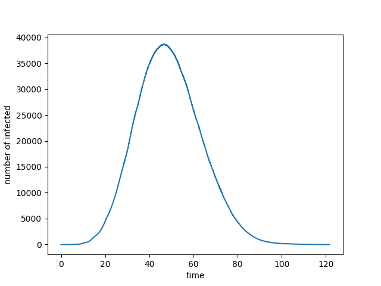

# Getting Started

## Set Up

NEXT-Net can be installed from a release package or built from source. Follow the instructions below to set up the library based on your preferred method.

### Installation from Release
To install the latest release, [download](https://github.com/oist/NEXTNetPy/releases) the latest release and run the following command in a terminal:

```bash
pip install nextnet-0.4.0.tar.gz
```

## How to Use

NEXT-Net allows users to simulate disease spread using various models. Below is an example of running a **SIR simulation** on a **Barabási-Albert random graph** using `networkx`.

### Example: SIR Simulation on a Barabási-Albert Graph

Here is an example of how to run a SIR simulation on a Barabasi-Albert random graph using networkx.

```python
import nextnet as nn
import networkx as nx
import matplotlib.pyplot as plt

n = 10**5 # size of the network
m = 1 # number of edges added per node
graph_nx = nx.barabasi_albert_graph(n,m)

# convert network to a NextNet object.
graph = nn.networkx(graph_nx)


# Define the distribution for the infection times (Gamma distributed)
MEAN_INFECTION = 5
VARIANCE_INFECTION = 1
psi = nn.transmission_time_gamma(MEAN_INFECTION,VARIANCE_INFECTION)

# Define the distribution for the recovery times
MEAN_RECOVERY = 14
VARIANCE_RECOVERY= 3
rho = nn.transmission_time_lognormal(MEAN_RECOVERY,VARIANCE_RECOVERY)

# Define the simulation object
sim = nn.simulate(graph,psi,rho,SIR=True)

# Add initial infections (node 0 infected at time t=0)
initial_infected = [(0,0)]
sim.add_infections(initial_infected)

# Set up random generator
seed = 0
rng = nn.rng(seed)

# Run simulation
results = sim.run(engine=rng)

# Plot results
plt.plot(results["time"],results["infected"])
plt.xlabel("time")
plt.ylabel("number of infected")
plt.show()
```

<p align="center">
  
</p>


For more advanced use cases and additional features, refer to the full documentation.

